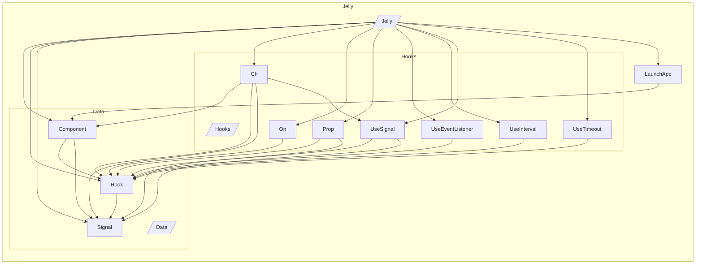

```mermaid
flowchart LR
subgraph Jelly_subgraph [Jelly]
Jelly[/Jelly/]
Jelly.LaunchApp[LaunchApp]
subgraph Jelly.Data_subgraph [Data]
Jelly.Data[/Data/]
Jelly.Data.Component[Component]
Jelly.Data.Hook[Hook]
Jelly.Data.Signal[Signal]
end
subgraph Jelly.Hooks_subgraph [Hooks]
Jelly.Hooks[/Hooks/]
Jelly.Hooks.Ch[Ch]
Jelly.Hooks.On[On]
Jelly.Hooks.Prop[Prop]
Jelly.Hooks.UseEventListener[UseEventListener]
Jelly.Hooks.UseInterval[UseInterval]
Jelly.Hooks.UseSignal[UseSignal]
Jelly.Hooks.UseTimeout[UseTimeout]
end
end
Jelly.LaunchApp --> Jelly.Data.Component
Jelly.Data.Component --> Jelly.Data.Hook
Jelly.Data.Component --> Jelly.Data.Signal
Jelly.Data.Hook --> Jelly.Data.Signal
Jelly.Hooks.Ch --> Jelly.Data.Component
Jelly.Hooks.Ch --> Jelly.Data.Hook
Jelly.Hooks.Ch --> Jelly.Data.Signal
Jelly.Hooks.Ch --> Jelly.Hooks.UseSignal
Jelly.Hooks.On --> Jelly.Data.Hook
Jelly.Hooks.Prop --> Jelly.Data.Hook
Jelly.Hooks.Prop --> Jelly.Data.Signal
Jelly.Hooks.UseEventListener --> Jelly.Data.Hook
Jelly.Hooks.UseInterval --> Jelly.Data.Hook
Jelly.Hooks.UseSignal --> Jelly.Data.Hook
Jelly.Hooks.UseSignal --> Jelly.Data.Signal
Jelly.Hooks.UseTimeout --> Jelly.Data.Hook
Jelly --> Jelly.Data.Component
Jelly --> Jelly.Data.Hook
Jelly --> Jelly.Data.Signal
Jelly --> Jelly.Hooks.Ch
Jelly --> Jelly.Hooks.On
Jelly --> Jelly.Hooks.Prop
Jelly --> Jelly.Hooks.UseEventListener
Jelly --> Jelly.Hooks.UseInterval
Jelly --> Jelly.Hooks.UseSignal
Jelly --> Jelly.Hooks.UseTimeout
Jelly --> Jelly.LaunchApp
```